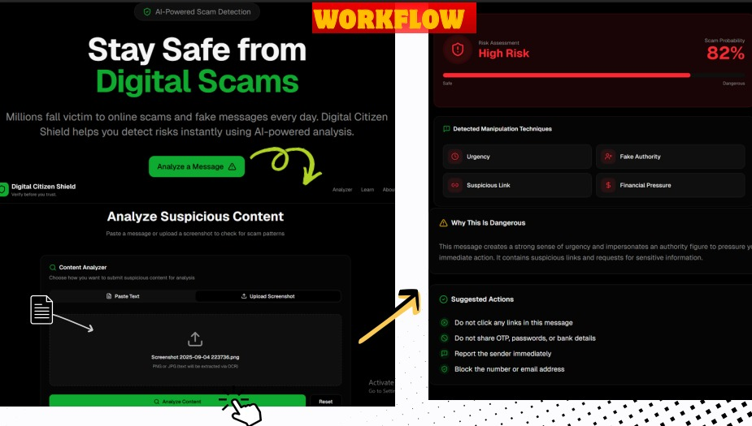

# 🛡️ Digital Citizen Shield  
### AI-Powered Scam Detection Platform

Stay safe from digital scams and fake messages. **Digital Citizen Shield** uses AI to analyze suspicious content and detect scam patterns like urgency, fake authority, suspicious links, and financial pressure.

---

## 🚀 Project Overview

Millions fall victim to online scams every day. This project helps users instantly analyze messages or screenshots and understand the **risk level, scam probability, and manipulation techniques** used.

---

## 🖼️ Workflow & UI Preview

  

---

## ⚙️ How It Works

1. Paste a suspicious message or upload a screenshot  
2. AI analyzes the content  
3. System detects scam patterns  
4. Risk level & probability are generated  
5. User receives clear safety actions  

---

## 🧠 Detected Techniques

- Urgency  
- Fake Authority  
- Suspicious Links  
- Financial Pressure  

---

## 🛑 Suggested Actions

- Do not click unknown links  
- Never share OTPs or passwords  
- Report the sender  
- Block the source  

---

## 🏗️ Project Status

🚧 Proof of Concept / Hackathon Project  

---

## 👨‍💻 Author

**Sabyasachi Dwivedi**

**Aayushman Singh Rathore**

---

⭐ If you find this project useful, consider giving it a star!

